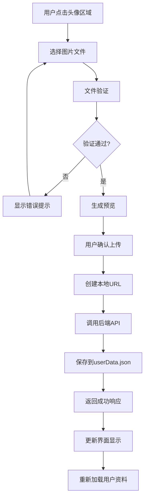

# 头像上传功能说明

## 功能概述

个人资料页面的头像上传功能允许用户选择、预览并保存个人头像。用户上传的头像会被持久化保存到 `userData.json` 文件中，确保用户刷新页面或重新登录时头像能够正确显示。

## 功能特性

### ✨ 核心功能
- 📷 **头像选择**：点击头像区域选择本地图片文件
- 👀 **实时预览**：选择图片后立即显示预览效果
- 💾 **持久化存储**：头像URL保存到userData.json文件
- 🔄 **即时更新**：上传成功后界面立即更新显示新头像
- ❌ **取消功能**：支持取消当前选择的头像

### 🛡️ 安全特性
- **文件类型验证**：仅支持图片文件格式
- **文件大小限制**：最大支持2MB的图片文件
- **错误处理**：完善的错误提示和处理机制

## 技术实现

### 前端实现

#### 1. 组件结构 (`src/views/Profile/index.vue`)

```vue
<div class="avatar-upload">
  <div class="avatar-display" @click="triggerFileInput">
    <!-- 头像显示区域 -->
    <div class="avatar-overlay">
      <span class="upload-text">点击上传</span>
    </div>
  </div>
  <input ref="fileInputRef" type="file" accept="image/*" @change="handleFileSelect" />
</div>

<!-- 头像预览区域 -->
<div v-if="previewAvatar" class="avatar-preview-section">
  <div class="preview-avatar" :style="{ backgroundImage: `url(${previewAvatar})` }"></div>
  <div class="preview-actions">
    <button @click="confirmAvatar">确认使用</button>
    <button @click="cancelPreview">取消</button>
  </div>
</div>
```

#### 2. 核心函数

##### 文件选择处理
```javascript
function handleFileSelect(event) {
  const file = event.target.files?.[0];
  
  // 文件类型验证
  if (!file.type.startsWith('image/')) {
    showMessage('请选择图片文件', 'error');
    return;
  }
  
  // 文件大小验证 (2MB限制)
  if (file.size > 2 * 1024 * 1024) {
    showMessage('图片大小不能超过 2MB', 'error');
    return;
  }
  
  // 创建预览URL
  const reader = new FileReader();
  reader.onload = (e) => {
    previewAvatar.value = e.target?.result;
  };
  reader.readAsDataURL(file);
}
```

##### 头像确认上传
```javascript
async function confirmAvatar() {
  if (!avatarFile.value) return;
  
  avatarUploading.value = true;
  try {
    // 创建本地URL
    const localUrl = URL.createObjectURL(avatarFile.value);
    
    // 调用后端API保存头像URL到userData.json
    const result = await uploadUserAvatar(authStore.userInfo!.id, localUrl);
    
    if (result.success) {
      showMessage('头像上传成功！');
      // 更新界面显示
      avatarUrl.value = result.data?.avatarUrl || localUrl;
      // 重新加载用户资料
      await loadUserProfile();
    }
  } finally {
    avatarUploading.value = false;
  }
}
```

#### 3. API调用 (`src/api/profile.ts`)

```typescript
export async function uploadUserAvatar(userId: number, avatarUrl: string): Promise<{
    success: boolean;
    message: string;
    data?: {
        avatarUrl: string;
        userId: number;
    };
}> {
    try {
        const response = await axiosInstance.put(`/profile/${userId}/avatar`, {
            avatarUrl
        });
        return response.data;
    } catch (error: any) {
        return {
            success: false,
            message: error.response?.data?.message || '头像上传失败'
        };
    }
}
```

### 后端实现 (`mockServer.js`)

#### 1. 头像上传API接口

```javascript
app.put('/api/profile/:userId/avatar', (req, res) => {
    try {
        const userId = parseInt(req.params.userId);
        const { avatarUrl } = req.body;
        
        // 输入验证
        if (!avatarUrl) {
            return res.status(400).json({
                success: false,
                message: '头像URL不能为空'
            });
        }
        
        // 查找用户
        let targetUser = null;
        for (const user of Object.values(users)) {
            if (user.id === userId) {
                targetUser = user;
                break;
            }
        }
        
        if (!targetUser) {
            return res.status(404).json({
                success: false,
                message: '用户不存在'
            });
        }
        
        // 确保profile对象存在
        if (!targetUser.profile) {
            targetUser.profile = {
                fullName: '',
                phone: '',
                bio: '',
                avatar: '',
                avatarUrl: '',
                twoFactorEnabled: false,
                lastPasswordChange: new Date().toISOString().split('T')[0]
            };
        }
        
        // 更新头像
        targetUser.profile.avatar = avatarUrl;
        targetUser.profile.avatarUrl = avatarUrl;
        
        // 保存到userData.json文件
        const saveSuccess = saveUsers();
        
        res.json({
            success: true,
            message: '头像上传成功',
            data: {
                avatarUrl: avatarUrl,
                userId: userId
            }
        });
        
    } catch (error) {
        res.status(500).json({
            success: false,
            message: '头像上传失败',
            error: error.message
        });
    }
});
```

#### 2. 数据结构

##### userData.json 文件结构
```json
{
  "users": {
    "admin": {
      "id": 1,
      "username": "admin",
      "email": "admin@example.com",
      "profile": {
        "fullName": "曾女士",
        "phone": "13692774696",
        "bio": "",
        "avatar": "",
        "avatarUrl": "blob:http://localhost:3000/xxx-xxx-xxx",
        "twoFactorEnabled": false,
        "lastPasswordChange": "2025-09-04"
      }
    }
  }
}
```

## 使用流程

### 用户操作步骤

1. **进入个人资料页面**
   - 导航到 `/profile` 路径
   - 页面显示当前用户信息和头像区域

2. **选择头像文件**
   - 点击头像显示区域
   - 系统打开文件选择对话框
   - 选择本地图片文件（支持常见图片格式）

3. **预览头像**
   - 选择文件后，系统自动生成预览
   - 预览区域显示选择的图片
   - 显示"确认使用"和"取消"按钮

4. **确认上传**
   - 点击"确认使用"按钮
   - 系统显示上传进度
   - 上传成功后显示成功提示

5. **头像更新**
   - 界面立即显示新头像
   - 头像数据保存到服务器
   - 刷新页面头像依然显示

### 系统处理流程



## 文件说明

### 相关文件列表

| 文件路径 | 功能说明 |
|---------|---------|
| `src/views/Profile/index.vue` | 个人资料页面主组件，包含头像上传UI |
| `src/api/profile.ts` | 个人资料相关API接口定义 |
| `mockServer.js` | 后端服务器，处理头像上传请求 |
| `userData.json` | 用户数据存储文件 |

### 主要函数说明

#### 前端函数

| 函数名 | 功能 | 位置 |
|-------|------|------|
| `handleFileSelect` | 处理文件选择，验证文件类型和大小 | Profile/index.vue |
| `confirmAvatar` | 确认上传头像，调用API保存 | Profile/index.vue |
| `cancelPreview` | 取消当前预览的头像 | Profile/index.vue |
| `loadUserProfile` | 加载用户资料，包括头像信息 | Profile/index.vue |
| `uploadUserAvatar` | 调用后端头像上传API | api/profile.ts |

#### 后端接口

| 接口 | 方法 | 功能 |
|------|------|------|
| `/api/profile/:userId/avatar` | PUT | 保存用户头像URL到数据文件 |
| `/api/profile/:userId` | GET | 获取用户资料，包括头像信息 |

## 配置说明

### 文件大小限制
- **前端限制**：2MB (在 `handleFileSelect` 函数中设置)
- **修改方法**：更改 `2 * 1024 * 1024` 这个值

### 支持的文件格式
- **当前支持**：所有图片格式 (`image/*`)
- **修改方法**：更改 `accept="image/*"` 属性

### 存储方式
- **当前方案**：使用 `URL.createObjectURL()` 生成本地blob URL
- **数据持久化**：保存到 `userData.json` 文件
- **注意事项**：blob URL在浏览器刷新后可能失效，适合本地演示

## 错误处理

### 常见错误及解决方案

1. **文件类型错误**
   - 错误信息：请选择图片文件
   - 解决方案：选择正确的图片格式文件

2. **文件过大错误**
   - 错误信息：图片大小不能超过 2MB
   - 解决方案：压缩图片或选择更小的文件

3. **网络错误**
   - 错误信息：网络错误，请稍后重试
   - 解决方案：检查网络连接和服务器状态

4. **用户不存在**
   - 错误信息：用户不存在
   - 解决方案：确认用户已正确登录

## 扩展建议

### 功能增强
1. **图片压缩**：前端自动压缩大图片
2. **多格式支持**：支持WebP等现代图片格式
3. **头像裁剪**：提供图片裁剪功能
4. **云存储**：集成云存储服务替代本地存储

### 性能优化
1. **缓存机制**：添加头像缓存策略
2. **懒加载**：大量用户时使用懒加载
3. **CDN支持**：使用CDN加速图片加载

### 安全增强
1. **文件扫描**：添加恶意文件检测
2. **访问控制**：限制头像访问权限
3. **水印功能**：自动添加水印防止盗用

## 维护说明

### 日志记录
- 后端会记录所有头像上传操作的详细日志
- 包括用户ID、上传时间、文件信息等

### 数据备份
- 建议定期备份 `userData.json` 文件
- 关键操作前进行数据备份

### 监控建议
- 监控头像上传成功率
- 跟踪文件大小分布
- 记录错误类型和频率

---

> 📝 **注意**: 此功能使用本地blob URL存储头像，适合开发和演示环境。生产环境建议使用专业的文件存储服务。