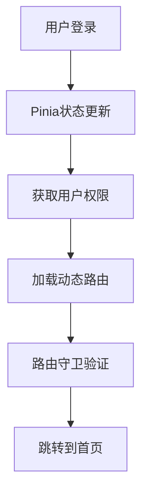
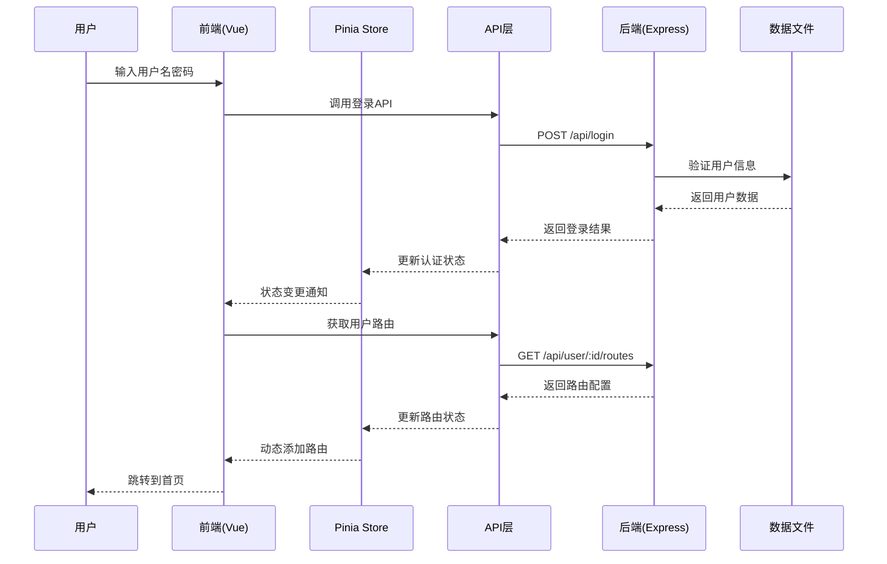
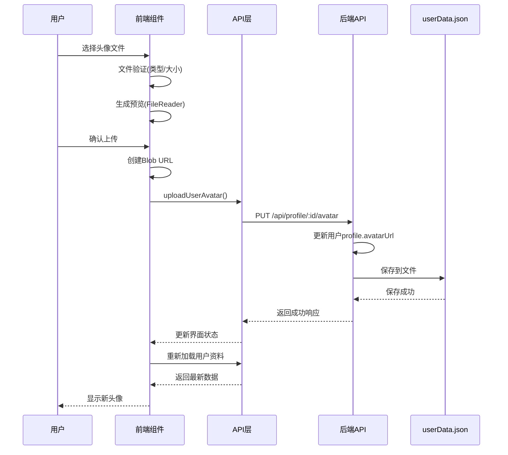
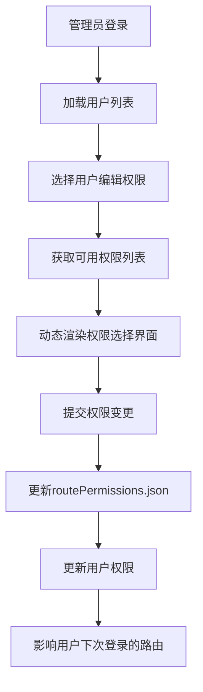

# 项目技术栈与功能流程说明

## 🏗️ 项目概述

这是一个基于 **Vue 3 + TypeScript + Node.js** 的全栈管理系统，采用前后端分离架构，具备用户管理、权限控制、个人资料管理等核心功能。

## 📚 技术栈详情

### 前端技术栈

| 技术 | 版本 | 用途说明 |
|------|------|----------|
| **Vue 3** | ^3.5.18 | 核心前端框架，采用Composition API |
| **TypeScript** | ~5.8.0 | 类型系统，提供静态类型检查 |
| **Vite** | ^7.0.6 | 构建工具和开发服务器 |
| **Vue Router 4** | ^4.5.1 | 前端路由管理，支持动态路由 |
| **Pinia** | ^3.0.3 | 状态管理库，替代Vuex |
| **Pinia Plugin Persistedstate** | ^4.5.0 | Pinia持久化插件 |
| **Axios** | ^1.11.0 | HTTP客户端，用于API调用 |
| **ECharts** | ^5.6.0 | 数据可视化图表库 |
| **file-saver** | ^2.0.5 | 文件下载功能 |
| **docx** | ^9.5.1 | Word文档生成 |

### 后端技术栈

| 技术 | 版本 | 用途说明 |
|------|------|----------|
| **Node.js** | ^20.19.0 \|\| >=22.12.0 | 运行时环境 |
| **Express** | ^5.1.0 | Web框架，提供RESTful API |
| **CORS** | ^2.8.5 | 跨域资源共享中间件 |
| **JSON文件存储** | - | 数据持久化方案（开发/演示环境） |

### 开发工具

| 工具 | 版本 | 用途说明 |
|------|------|----------|
| **Vue DevTools** | ^8.0.0 | Vue开发调试工具 |
| **npm-run-all2** | ^8.0.4 | 并行运行脚本工具 |
| **vue-tsc** | ^3.0.4 | Vue TypeScript类型检查 |

## 🚀 项目启动流程

### 开发环境启动

```bash
# 1. 安装依赖
npm install

# 2. 并行启动前端开发服务器和Mock后端
npm start
# 等价于: npm run dev & npm run mock

# 3. 分别启动（可选）
npm run dev    # 启动前端开发服务器 (http://localhost:3000)
npm run mock   # 启动Mock后端服务器 (http://localhost:3001)
```

### 生产环境构建

```bash
# 类型检查 + 构建
npm run build

# 预览构建结果
npm run preview
```

## 🎯 核心功能模块

### 1. 用户认证系统 🔐

#### 技术实现
- **前端**: Pinia状态管理 + Vue Router路由守卫
- **后端**: Express中间件 + JSON文件存储
- **API封装**: `src/api/auth.ts`

#### 功能特性
```typescript
// Pinia状态管理 - src/stores/auth.ts
interface AuthState {
    isAuthenticated: boolean;
    userId: number;
    userInfo: UserInfo | null;
    routesLoaded: boolean;
    menuRoutes: RouteRecordRaw[];
    homePage: string;
}
```

#### 流程图


### 2. 权限管理系统 🛡️

#### 技术实现
- **动态路由**: Vue Router + 权限配置文件
- **菜单渲染**: 基于用户权限动态生成
- **API权限**: 后端接口级别的权限控制

#### 权限配置
```json
// routePermissions.json
{
  "availableRoutes": [...],
  "userRoutePermissions": {
    "admin": ["Dashboard", "UserManagement", "Profile"],
    "user": ["Dashboard", "Profile"],
    "guest": ["Profile"]
  }
}
```

### 3. 个人资料管理 👤

#### 技术实现
- **头像上传**: File API + Blob URL + 持久化存储
- **表单验证**: Vue响应式验证
- **数据同步**: API调用 + Pinia状态更新

#### 核心功能
- ✅ 基本信息编辑（姓名、邮箱、电话、简介）
- ✅ 头像上传预览与保存
- ✅ 密码修改
- ✅ 双重认证开关

### 4. 用户管理系统 👥

#### 技术实现
- **CRUD操作**: RESTful API设计
- **批量操作**: 前端表格组件 + 后端批处理
- **权限分配**: 动态权限配置

#### API接口
```typescript
// src/api/userManagement.ts
export async function createUser(userData: CreateUserRequest)
export async function updateUser(userId: number, userData: UpdateUserRequest)
export async function deleteUser(userId: number)
export async function fetchUsers()
```

### 5. 数据中心 📊

#### 技术实现
- **数据可视化**: ECharts图表库
- **数据导出**: file-saver + docx
- **实时更新**: 轮询 + 响应式数据

#### 功能模块
- 📈 **数据面板**: 设备状态监控
- 📋 **数据管理**: 增删改查 + 分页排序
- 📄 **报表导出**: Excel/Word文档生成

## 🔧 API架构设计

### API封装策略

#### 1. Axios实例配置
```typescript
// src/services/axiosInstance.ts
const axiosInstance = axios.create({
    baseURL: import.meta.env.VITE_API_BASE_URL || '/api',
    timeout: 10000,
    headers: {
        'Content-Type': 'application/json',
    },
});
```

#### 2. 请求/响应拦截器
- **请求拦截**: 自动添加认证Token
- **响应拦截**: 统一错误处理和日志记录

#### 3. API模块化设计
```
src/api/
├── auth.ts           # 认证相关API
├── userManagement.ts # 用户管理API
├── profile.ts        # 个人资料API
├── permissions.ts    # 权限管理API
├── dashboard.ts      # 仪表板API
├── dataCenter.ts     # 数据中心API
└── activity.ts       # 活动记录API
```

#### 4. TypeScript类型定义
```typescript
// src/types/router.ts
export interface UserInfo {
    id: number;
    username: string;
    permissions: string[];
}

export interface CreateUserRequest {
    username: string;
    email: string;
    password: string;
    permissions?: string[];
    routePermissions?: string[];
}
```

## 🗄️ Pinia状态管理

### 状态管理架构

#### 1. Store模块化
```
src/stores/
├── auth.ts     # 认证状态管理
└── counter.ts  # 计数器示例
```

#### 2. 持久化策略
```typescript
// src/main.ts
import piniaPluginPersistedstate from 'pinia-plugin-persistedstate';

const pinia = createPinia();
pinia.use(piniaPluginPersistedstate);
```

#### 3. 认证Store详情
```typescript
// src/stores/auth.ts
export const useAuthStore = defineStore('auth', {
    state: (): AuthState => ({
        isAuthenticated: false,
        userId: 0,
        userInfo: null,
        routesLoaded: false,
        menuRoutes: [],
        homePage: '/dashboard'
    }),
    
    actions: {
        async login(username: string, password: string): Promise<boolean>
        async loadDynamicRoutes(): Promise<void>
        logout(): void
        updateUserInfo(userInfo: UserInfo): void
    }
});
```

#### 4. 动态路由加载
- **启动时恢复**: 应用启动时检查登录状态并恢复路由
- **权限验证**: 基于用户权限动态生成菜单和路由
- **路由守卫**: 确保用户只能访问有权限的页面

## 🌐 前后端通信流程

### 开发环境代理配置
```typescript
// vite.config.ts
server: {
    proxy: {
        '/api': {
            target: 'http://localhost:3001',
            changeOrigin: true,
            secure: false,
        }
    }
}
```

### Mock服务器功能
```javascript
// mockServer.js
app.listen(3001, () => {
    console.log('✅ Mock服务器运行在 http://localhost:3001');
    console.log('📝 可用接口:');
    console.log('   POST /api/login     - 用户登录');
    console.log('   POST /api/register  - 用户注册');
    console.log('   GET  /api/users     - 获取用户列表');
    // ... 更多接口
});
```

### 数据持久化
- **存储方式**: JSON文件 (`userData.json`, `routePermissions.json`)
- **数据同步**: 内存操作 + 文件写入
- **备份机制**: 优雅关闭时自动保存数据

## 🔄 完整业务流程

### 1. 用户登录流程


### 2. 头像上传流程


### 3. 权限管理流程


## 📁 项目目录结构

```
c:\Users\yl181\Desktop\9.22\
├── public/                 # 静态资源
├── src/
│   ├── api/               # API接口封装
│   │   ├── auth.ts        # 认证API
│   │   ├── profile.ts     # 个人资料API
│   │   ├── userManagement.ts # 用户管理API
│   │   └── ...
│   ├── components/        # 公共组件
│   │   └── NavBar.vue     # 导航栏组件
│   ├── router/           # 路由配置
│   │   ├── index.ts      # 路由主配置
│   │   └── guards.ts     # 路由守卫
│   ├── services/         # 服务层
│   │   └── axiosInstance.ts # Axios配置
│   ├── stores/           # Pinia状态管理
│   │   ├── auth.ts       # 认证状态
│   │   └── counter.ts    # 计数器状态
│   ├── types/            # TypeScript类型定义
│   ├── utils/            # 工具函数
│   ├── views/            # 页面组件
│   │   ├── Dashboard/    # 仪表板
│   │   ├── Profile/      # 个人资料
│   │   ├── UserManagement/ # 用户管理
│   │   └── ...
│   ├── App.vue           # 根组件
│   └── main.ts           # 应用入口
├── mockServer.js          # Mock后端服务器
├── userData.json          # 用户数据存储
├── routePermissions.json  # 路由权限配置
├── package.json           # 项目依赖配置
├── vite.config.ts         # Vite构建配置
├── tsconfig.json          # TypeScript配置
└── .env.development       # 开发环境变量
```

## 🛠️ 开发特性

### 1. 热重载开发
- **前端**: Vite HMR + Vue DevTools
- **后端**: 文件监听 + 自动重启

### 2. 类型安全
- **全栈TypeScript**: 前后端统一类型定义
- **接口类型**: API请求/响应类型约束
- **组件Props**: Vue组件属性类型检查

### 3. 错误处理
- **全局错误拦截**: Axios响应拦截器
- **用户友好提示**: 统一错误消息显示
- **开发调试**: 详细的控制台日志

### 4. 性能优化
- **代码分割**: Vite动态导入
- **资源压缩**: 生产环境自动压缩
- **缓存策略**: 静态资源缓存配置

## 🚀 部署说明

### 开发环境
```bash
npm start  # 并行启动前后端服务
```
- 前端: http://localhost:3000
- 后端: http://localhost:3001

### 生产环境
```bash
npm run build  # 构建前端静态文件
```
- 输出目录: `dist/`
- 后端服务: 独立部署Node.js应用

## 📊 功能统计

| 功能模块 | API数量 | 页面数量 | Store数量 |
|---------|---------|----------|-----------|
| 用户认证 | 3个 | 1个 | 1个 |
| 用户管理 | 8个 | 1个 | 0个 |
| 个人资料 | 4个 | 1个 | 0个 |
| 权限管理 | 5个 | 集成 | 0个 |
| 数据中心 | 4个 | 4个 | 0个 |
| **总计** | **24个** | **8个** | **1个** |

---

> 📝 **总结**: 这是一个功能完整的现代化全栈管理系统，采用了业界主流的技术栈和最佳实践，具备良好的可扩展性和维护性。通过模块化设计、类型安全和状态管理，确保了代码质量和开发效率。